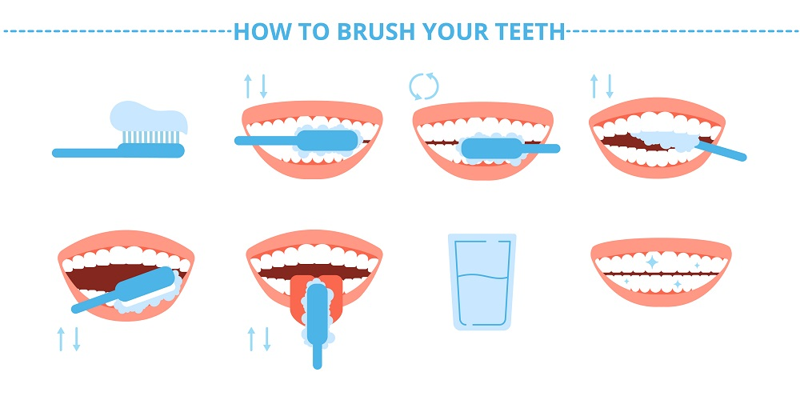

# Инструкция по чистке зубов
***

### Шаг 1: Подготовка
1. Возьмите свою зубную щетку. 
2. Нанесите на щетку небольшое количество зубной пасты (размером с горошину).

### Шаг 2: Чистка зубов
1. Начните с верхних боковых зубов справа. Чистите выметающими движениями: от десны к зубу. 
2. Постепенно перемещайтесь вперед, продолжая чистить наружную поверхность зубов выметающими движениями.
3. После завершения верхнего ряда зубов перейдите к нижнему ряду и повторите.
4. Не забывайте про чистку внутренней поверхности зубов!

#### Шаг 3: Чистка языка
1. Мягкими движениями почистите поверхность языка от задней части к передней. Это поможет избавиться от бактерий налета на языке.

#### Шаг 4: Чистка межзубных промежутков
1. Возьмите свою зубную нить.
2. Возьмите зубную нить указательными пальцами, натяните ее.
3. Пройдите зубной нить в межзубной промежуток, начиная с верхних правых зубов.
4. После завершения верхнего ряда зубов перейдите к нижнему ряду и повторите.

#### Шаг 5: Завершение
1. Прополощите зубную щетку под проточной водой.
2. Храните зубную щетку вертикально, без колпачка на ее рабочей части.

#### Рекомендации:
- Чистите зубы не менее двух минут, уделяйте каждой секции рта примерно 30 секунд.
- Меняйте зубную щетку каждые три месяца или при первых признаках износа.
- Посещайте врача-стоматолога каждые полгода, чтобы следить за здоровьем своей полости рта.
