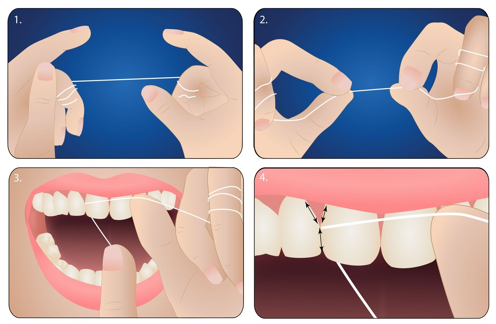
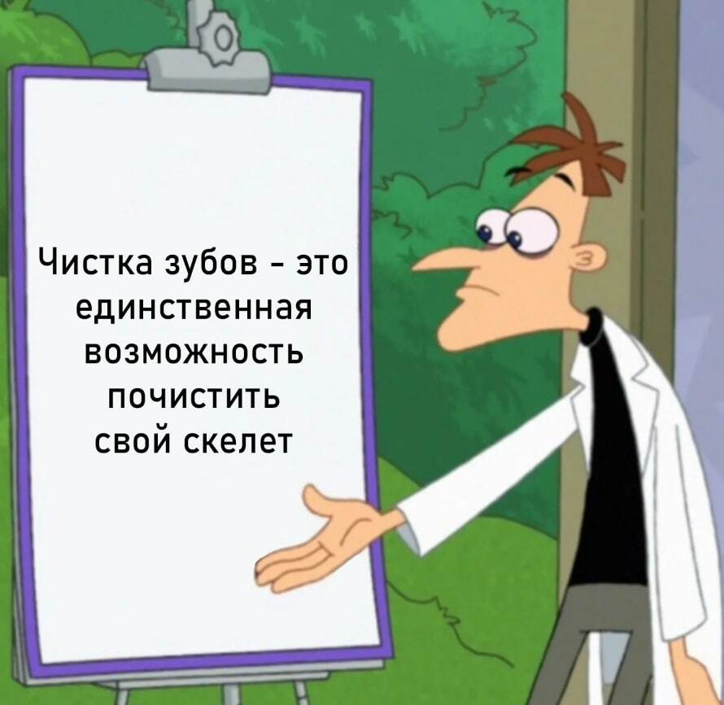

# Инструкция по чистке зубов

***

## Шаг 1: Подготовка
1. Возьмите свою зубную щетку.
2. Нанесите на щетку небольшое количество зубной пасты (размером с горошину).

## Шаг 2: Чистка зубов
1. Начните с внешней стороны верхних зубов. Чистите выметающими движениями, а не горизонтальными движениями.
3. Перейдите к нижнему ряду и повторите.
4. Перейдите к чистке внутренней поверхности зубов.
5. Перейдите к чистке жевательной поверхности зубов. 

## Шаг 3: Чистка языка
1. Мягкими движениями почистите поверхность языка от задней части к передней.

## Шаг 4: Чистка межзубных промежутков
1. Возьмите зубную нить.
2. Натяните нить указательными пальцами.
3. Пройдите нитью между зубами, начиная с верхних.
4. Очистите все межзубные промежутки верхних зубов, затем нижних.

## Шаг 5: Завершение
1. Прополощите зубную щетку под проточной водой.
2. Храните зубную щетку вертикально, без колпачка.

## Рекомендации
- Чистите зубы 2-3 минуты.
- Меняйте щетку каждые три месяца или при износе.
- Посещайте стоматолога каждые полгода.

